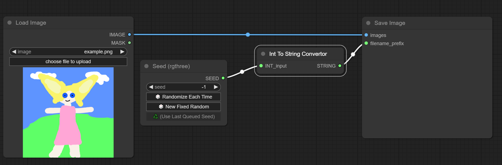

# ComfyUI INT to STRING convertor

This ComfyUI custom node provides ability to convert INT value (like SEED) to STRING type.

## Installation

To install, clone this repository into `ComfyUI/custom_nodes/` folder with `git clone https://github.com/IvanRybakov/comfyui-node-int-to-string-convertor.git` and restart ComfyUI.
